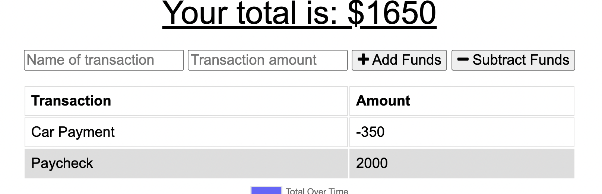
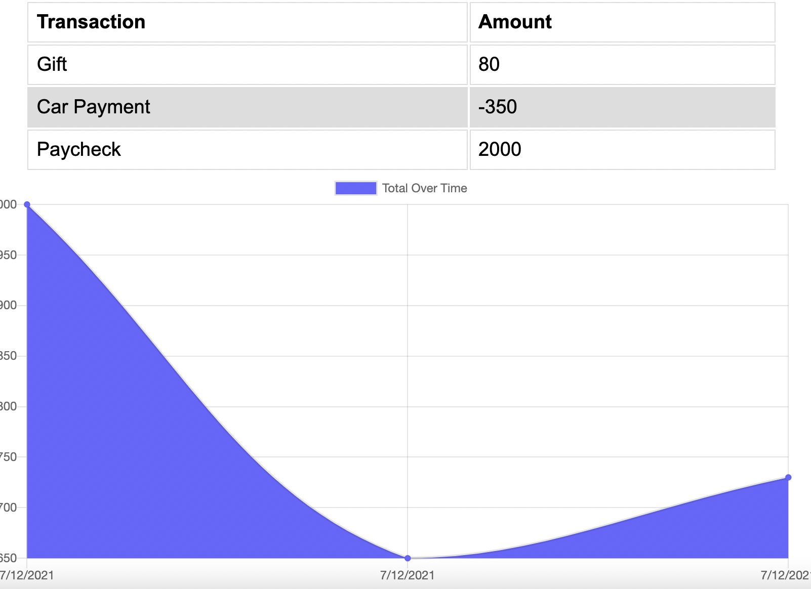

# Progressive Budget Project

## Table of Contents
            
- [Description](#Description)
- [Usage](#Usage)
- [Questions](#Questions)

### Description
For this project, I was tasked to finish an application that will allow the user to track their money. To complete this application, I first added indexedDb to the app so that any changes will be saved and bulk added once back online. To do this I added db.js and created an Transaction database and store. With this information saved any changes made on the front page will be saved even when offline.

I then worked on adding PWA functionality. I first added a manifest where I made note of the icons and design of the app. I then connected this manifest to the index.html before moving on to the service worker. With the service worker, I created a list of all of the files that needed to be cached for the site to work offline, such as the index.html, stylesheet, icons, and the chart. Once this was added I created the routes for the caches to be read and loaded while offline.

### Usage
To use this application, you need to open the app from heroku. On the main screen, you will see inputs for transaction name and amount. Fill these out and select the corresponding button to the intention of the transaction. Once you have selected either add or subtract, continue to add transactions. As you do this, you will see the chart update. From here you can open the inspector tools and go to application, here select service workers and go offline. You will still be able to see the page and add or subtract from your funds. Any changes you make are saved and once you are online they will be bulk added to the page.

Here is a link to the depolyed application: https://intense-shelf-28143.herokuapp.com/

### Questions
My Github: https://github.com/morrisbianco

andrewbianco98@gmail.com: Please contact me through this E-mail address with any further questions that you may have.